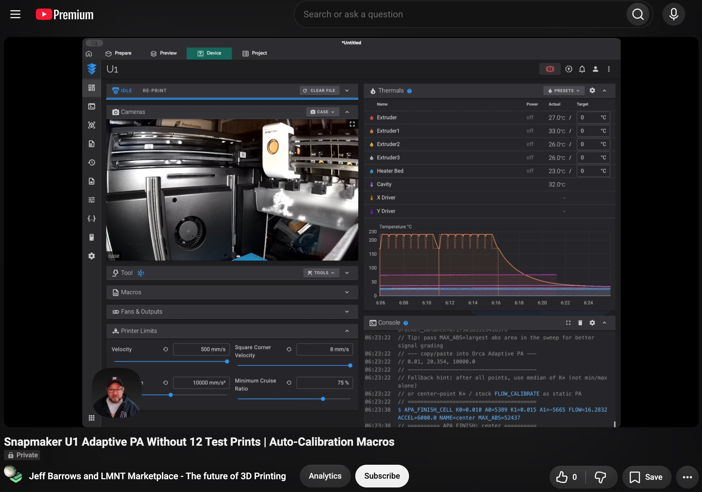

# U1 Adaptive Pressure Advance Auto Calibration

<p align="center">
  <a href="https://www.youtube.com/watch?v=TzlhBpQkZEI">
    
  </a>
</p>

**Sensor-driven OrcaSlicer Adaptive Pressure Advance tables generator for the Snapmaker U1.**

Uses the U1’s stock inductance flow sensor and `FLOW_MEASURE_K` (pure-E velocity steps + residual `area`) so you can build Adaptive PA rows **without** printing and scoring line tests. Klipper macros only — no firmware fork required.

```text
PA, flow_mm3_s, accel_mm_s2
```

## Docs & video

| | |
|--|--|
| **Blog post** | [Snapmaker U1 Adaptive Pressure Advance auto-calibration](https://garagenotes.lmnt.co/Snapmaker-U1-Adaptive-Pressure-Advance-auto-calibration.html) |
| **YouTube** | [Walkthrough](https://www.youtube.com/watch?v=TzlhBpQkZEI) (thumbnail above) |
| **User guide** | [docs/USER_GUIDE.md](docs/USER_GUIDE.md) |

## What’s in this repo

| Path | Purpose |
|------|---------|
| [`adaptive_pa_macro.cfg`](adaptive_pa_macro.cfg) | Klipper gcode macros (box-style 5-point suite + finish helpers) |
| [`docs/USER_GUIDE.md`](docs/USER_GUIDE.md) | Install, quick start, presets, troubleshooting, command reference |
| [`docs/METHODOLOGY.md`](docs/METHODOLOGY.md) | Residual `area`, box design, confidence scoring, kinematics |
| [`docs/COIL_DATA_CAPTURE.md`](docs/COIL_DATA_CAPTURE.md) | Optional coil frequency capture and waveform analysis |
| [`scripts/coil_dump_client.py`](scripts/coil_dump_client.py) | Optional coil frequency capture / plot (Moonraker or UDS) |
| [`docs/images/`](docs/images/) | README/YouTube thumbnail + example coil scope captures |

## Quick install (printer)

1. Copy `adaptive_pa_macro.cfg` onto the printer (e.g. next to `printer.cfg`, or into a config subdirectory).
2. Include it in your `printer.cfg` and restart Klipper:

```ini
[include adaptive_pa_macro.cfg]
```

3. Run a full suite (example: tool 0, 220 °C):

```gcode
APA_COIL_RUN_ALL EXTRUDER=0 TEMP=220
```

4. For each test point, find the `area` sign flip and run `APA_FINISH_CELL` / `APA_FINISH_LAST` as described in the [user guide](docs/USER_GUIDE.md).
5. Paste the resulting rows into OrcaSlicer → Filament → Adaptive pressure advance.

Full walkthrough: **[docs/USER_GUIDE.md](docs/USER_GUIDE.md)** · narrative write-up: **[blog](https://garagenotes.lmnt.co/Snapmaker-U1-Adaptive-Pressure-Advance-auto-calibration.html)**.

## Optional: coil waveform capture

Console `area` lines are enough for calibration. To plot raw coil frequency while a test runs (laptop-friendly via Moonraker):

```bash
python3 -m venv .venv
source .venv/bin/activate
pip install -r requirements.txt

python3 scripts/coil_dump_client.py \
  --moonraker http://PRINTER_IP \
  --sensor extruder2 \
  --name apa_center_t2
```

Then run `APA_COIL_*` in Fluidd; press Enter when the point finishes. See **[docs/COIL_DATA_CAPTURE.md](docs/COIL_DATA_CAPTURE.md)**.

## Requirements

- Snapmaker U1 (or compatible stack) with working `[flow_calibrator]` / inductance coil flow sensing
- Stock `FLOW_MEASURE_K` / `FLOW_CALIBRATE` (no custom Klipper Python required for the macros)
- OrcaSlicer Adaptive Pressure Advance table support
- Optional client: Python 3.8+, `numpy`, `matplotlib`

## License

This project’s macros, documentation, images, and client are licensed under the **GNU General Public License v3.0** — see [LICENSE](LICENSE).

Klipper, Snapmaker firmware, Moonraker, and OrcaSlicer remain under their own licenses. This repository does not relicense those projects.

## Credits & related work

- Snapmaker U1 flow calibrator / inductance coil residual measurement (`area`)
- [OrcaSlicer Adaptive Pressure Advance](https://github.com/OrcaSlicer/OrcaSlicer/wiki/adaptive_pressure_advance_calib)
- Inspired by the broader PA tuning ecosystem (e.g. CNC Kitchen / PrusaPATuner-style visualization), adapted here for U1 sensor auto-cal and Adaptive PA *tables*

## Disclaimer

Community tooling for research and tuning. Verify results on your machine and filament. Not affiliated with Snapmaker or OrcaSlicer.
