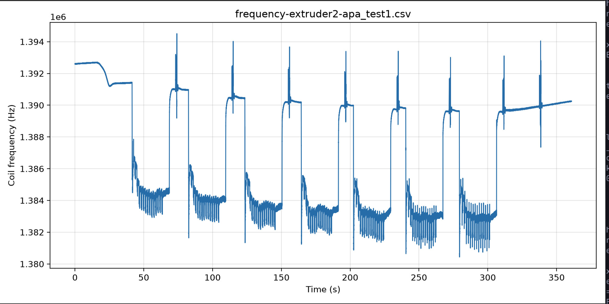
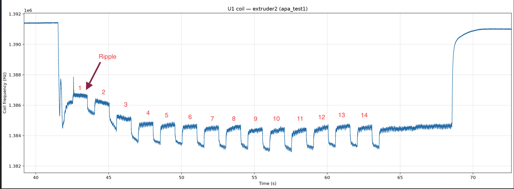
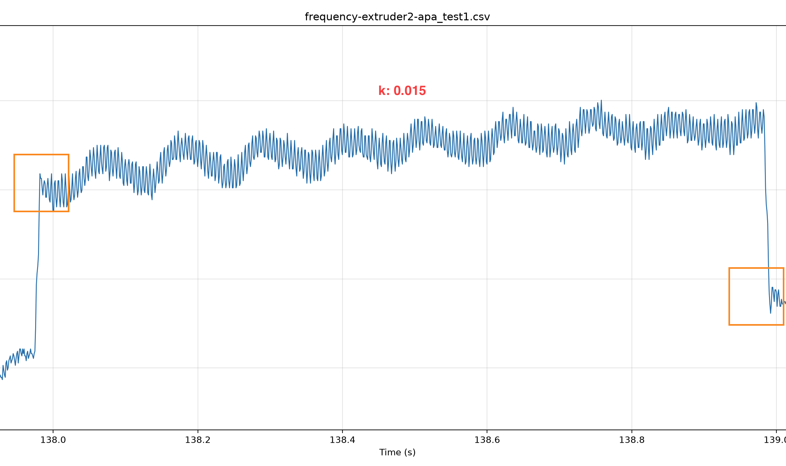
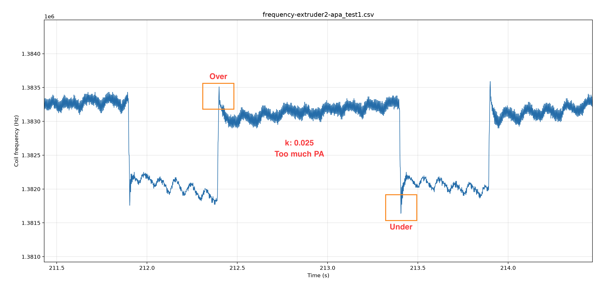
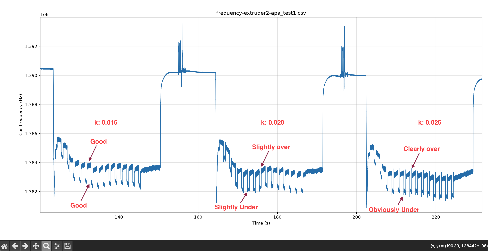

# U1 Adaptive PA AutoCal — User Guide

Macros in [`adaptive_pa_macro.cfg`](../adaptive_pa_macro.cfg) help build an **OrcaSlicer Adaptive Pressure Advance** table using the Snapmaker U1's stock `FLOW_MEASURE_K` command (pure-E velocity steps + toolhead flow residual). **No Klipper Python changes are required.**

Rather than slicing, printing, and visually scoring **5 to 10+ calibration prints** per toolhead (as recommended in [OrcaSlicer's Adaptive PA guide](https://github.com/OrcaSlicer/OrcaSlicer/wiki/adaptive_pressure_advance_calib)), these macros streamline calibration in two key ways:

1. **Automated Sensor Measurement:** Uses the U1's inductance flow sensor to measure extrusion pressure residuals directly in a non-printing test run (eliminating bed heating, printed line inspection, and manual scoring).
2. **Reduced Test Count (Box-Style Methodology):** Uses Box-style response surface sampling (4 envelope corners plus 1 center point) to accurately map the full operating envelope in just 5 smart test points instead of an exhaustive grid search.

For a 4-toolhead U1, this replaces **20 to 40+ individual calibration prints** with a fast, sensor-driven process to generate your OrcaSlicer table rows:

```text
PA, flow_mm3_s, accel_mm_s2
```

---

## 1. Prerequisites

Before running the calibration, ensure:

1. **Working Flow Sensor:** U1 with `[flow_calibrator]` and operational inductance-based flow sensing.
2. **Loaded Filament & Clean Nozzle:** Target filament loaded on the tool you wish to test, nozzle clean of debris for purges.
3. **Idle Printer at Printing Temp:** Machine idle (not printing) heated to your filament's standard printing temperature (e.g., PLA at 220 °C).
4. **Include Macro File:** Add the macro to `printer.cfg` and restart Klipper:

```ini
[include adaptive_pa_macro.cfg]
```

---

## 2. Quick Start Guide (3-Step Walkthrough)

Calibrating a toolhead takes about 25 minutes using the automated 5-point test suite.

### Step 1: Run the automated test suite

To run the complete 5-point calibration suite on a single toolhead, execute:

```gcode
APA_COIL_RUN_ALL EXTRUDER=0 TEMP=220
```

*(Or run all toolheads sequentially: `APA_COIL_RUN_ALL_TOOLS TOOLS=0,1,2,3 TEMP=220`)*

The printer automatically selects the specified tool, heats the nozzle to temperature, and runs the entire 5-point test suite in one continuous pass.

---

### Step 2: Read the log output and run finish commands

After `APA_COIL_RUN_ALL` completes, review your console log. Each of the 5 test points prints a block of `k` values followed by a `MEASURE DONE` banner.

For each test point block:
1. Find the pair of lines where `area` **flips from positive to negative**:

```text
k0.010: area: 12450
k0.015: area: 5128
k0.020: area: -5281
k0.025: area: -11800
```

2. Copy the template command printed in that test point's `MEASURE DONE` banner (which includes `FLOW`, `ACCEL`, and `NAME`) and fill in `K0`, `A0`, `K1`, and `A1`:

```gcode
APA_FINISH_CELL K0=0.015 A0=5128 K1=0.020 A1=-5281 FLOW=8.14 ACCEL=2000 NAME=low_anchor MAX_ABS=12450
```

*(Note: If you run test points individually or process the very last point immediately after it finishes, you can use the shortcut `APA_FINISH_LAST K0=0.015 A0=5128 K1=0.020 A1=-5281`. When reviewing prior points in the log after the full suite finishes, use `APA_FINISH_CELL` as shown above).*

*Tip: `area` flips from positive (K too low) to negative (K too high). `MAX_ABS=` takes the largest absolute sensor magnitude from that sweep (always entered as a positive number, e.g., `MAX_ABS=12450`), which allows the macro to accurately grade signal-to-noise ratio.*

---

### Step 3: Copy the line into OrcaSlicer

`APA_FINISH_LAST` calculates the exact zero-crossing Pressure Advance ($K^*$) and outputs a paste-ready row:

```text
========== APA FINISH: low_anchor ==========
Bracket: k=0.015 area=5128  ->  k=0.020 area=-5281
K* (zero cross): 0.01742  ->  rounded 0.017
Confidence: 84/100 (excellent) | good signal | bracket_balance=0.985 | clean zero
--- copy/paste into Orca Adaptive PA ---
0.017, 8.14, 2000
----------------------------------------
```

Repeat **Step 2** for each of the 5 test points. Copy all 5 output rows into OrcaSlicer:

**Filament Settings $\rightarrow$ Enable adaptive pressure advance $\rightarrow$ Adaptive pressure advance measurements**

---

## 3. Presets & Envelope Tuning

Default geometry and speed/acceleration envelopes are configured in `_APA_COIL_CFG`:

| Parameter | Default |
|-----------|---------|
| Nozzle / Layer Height / Line Width | 0.4 / 0.2 / 0.45 mm |
| Filament Diameter | 1.75 mm |
| Line Area ($A_{\text{line}}$) | 0.081416 mm² |
| Flow ($Q = v_{\text{XY}} \cdot A_{\text{line}}$) | Calculated automatically |
| Speeds (low / mid / high) | **100 / 200 / 250** mm/s |
| Accels (low / mid / high) | **2000 / 6000 / 10000** mm/s² |

The 5 test points evaluate your machine across this operating envelope:

| Test Point | XY Speed | XY Accel | Volumetric Flow ($Q$) | Role |
|------------|----------|----------|-----------------------|------|
| `low_anchor` | 100 mm/s | 2000 mm/s² | ~8.1 mm³/s | Low flow at HQ outer wall acceleration |
| `high_flow` | 250 mm/s | 2000 mm/s² | ~20.4 mm³/s | High flow at soft acceleration |
| `high_force` | 100 mm/s | 10000 mm/s² | ~8.1 mm³/s | Low flow at inner wall / infill acceleration |
| `stress` | 250 mm/s | 10000 mm/s² | ~20.4 mm³/s | Combined high flow + high acceleration |
| `center` | 200 mm/s | 6000 mm/s² | ~16.3 mm³/s | Mid-point print condition |

---

### Envelope Presets

You can easily select standard envelope presets before running `APA_COIL_RUN_ALL`:

```gcode
# Standard Orca profile HQ defaults (100-250 mm/s, 2k-10k accel)
APA_COIL_PRESET_U1_DEFAULT

# Normal outer (4k) to inner (10k) acceleration profile
APA_COIL_PRESET_ORCA_NORMAL

# Quality mode: constant single acceleration (default 2000 mm/s²)
APA_COIL_PRESET_SHAPER_QUALITY ACCEL=2000

# High-flow nozzle preset (wider speed range)
APA_COIL_PRESET_HIGH_FLOW LOW_SPEED=150 HIGH_SPEED=300

# Fully custom envelope
APA_COIL_SET_ENVELOPE LOW_SPEED=120 HIGH_SPEED=280 LOW_ACCEL=4000 HIGH_ACCEL=8000
```

---

### Speed Limit Check (Filament Flow Ceiling)

Do not set `HIGH_SPEED` faster than your hotend and filament can melt. Testing faster than your hotend can flow will cause clicking, under-extrusion, or test failures.

**How to calculate your maximum safe speed:**
1. Check your filament's **Max Volumetric Speed** in OrcaSlicer (e.g., `16.3 mm³/s` for standard PLA).
2. Divide that number by **0.0814** (the standard line area for a 0.4 mm nozzle at 0.2 mm layer height).

$$\text{Max Speed (mm/s)} = \frac{\text{Max Volumetric Speed}}{0.0814}$$

*Example:*  
If your filament is rated for **16.3 mm³/s**:
$$\text{Max Speed} = \frac{16.3}{0.0814} \approx 200\text{ mm/s}$$

Set `HIGH_SPEED=200` (or lower) so your test points remain within your hotend's flow limits.

---

### Time and Filament Costs

With default envelope settings and standard scan parameters (7 steps per point):

| Scope | Time (approx.) | Filament Usage (approx., 1.75 mm PLA) |
|-------|----------------|-----------------------------------------|
| **Single test point** | ~5 minutes | ~3–5 g |
| **Full suite (1 tool, 5 points)** | ~25 minutes | ~20 g (~5 m) |
| **All 4 toolheads (`RUN_ALL_TOOLS`)** | ~1.5 to 2 hours | ~80 g |

*Tip: Pass `SKIP_STRESS=1` to `APA_COIL_RUN_ALL` if your hotend cannot sustain high speed at maximum acceleration. This saves ~5 minutes and ~4 grams of filament.*

---

### Choosing Fallback Static PA

OrcaSlicer requires a single static **Pressure advance** value to use when Adaptive PA is disabled or unmapped.

**Simple 3-Step Recipe:**
1. Collect the calculated $K^*$ values for all good test points.
2. Sort the values from smallest to largest.
3. Take the **median value** (the middle number) and enter it as your main filament Pressure Advance in OrcaSlicer.

*Example:* For $K^*$ values of `0.012, 0.013, 0.016, 0.017, 0.023`, the median is **0.016**.

---

### Advanced Operations & Custom Test Points

Re-run an individual point or perform fine-resolution scans around a suspected root:

```gcode
# Select tool
APA_SELECT_TOOL EXTRUDER=0

# Run a single test point from the envelope
APA_COIL_HIGH_FLOW MODE=MEASURE TEMP=220

# Run a custom fine-step scan around K=0.025
APA_COIL_CELL NAME=fine_flow SPEED=200 ACCEL=6000 MIN=0.020 MAX=0.030 STEP=0.002

# Format a known K directly into an Orca line without interpolation
APA_ORCA_LINE K=0.024 FLOW=16.28 ACCEL=6000 NAME=manual_entry
```

---

## 4. Troubleshooting & Command Reference

### Troubleshooting Guide

| Symptom | Probable Cause | Recommended Action |
| :--- | :--- | :--- |
| `Unknown command: "APA_COIL_1"` | Digits in macro name | Use named macro like `APA_COIL_LOW_ANCHOR`. |
| `extruder ... not activated` | Active tool mismatch | Run `APA_SELECT_TOOL EXTRUDER=n`. |
| All `area` values have the same sign | $K^*$ is outside current scan range | Widen `MIN` or `MAX` search bounds. |
| Low `area` magnitudes (~hundreds) | Weak excitation signal (low speed) | Point has weak SNR, do not overfit. |
| Stress test point clicks or skips | Hotend flow rate exceeded | Use `SKIP_STRESS=1` or lower `HIGH_SPEED`. |
| Macro template error in `.cfg` | Inline `#` character in macro body | Remove `#` from Jinja or `gcode:` blocks. |
| Coil CSV shorter than the test / missing later $K$ combs | Downloaded while async `FREQUENCY_MEASURE` write still running | Re-download full file from Fluidd `gcodes/frequency_data/` (see [§6](#6-optional-coil-frequency-capture--waveform-analysis)). |

---

### Macro Command Reference

| Command | Description |
| :--- | :--- |
| `APA_COIL_RUN_ALL` | Runs full 5-point test suite on specified `EXTRUDER`. |
| `APA_COIL_RUN_ALL_TOOLS` | Runs full suite across multiple toolheads (`TOOLS=0,1,2,3`). |
| `APA_FINISH_LAST` | Interpolates $K^*$, grades confidence, and outputs Orca row using last point. |
| `APA_FINISH_CELL` | Full finish macro with explicit `FLOW`, `ACCEL`, and `NAME` parameters. |
| `APA_COIL_SHOW_ENVELOPE` | Prints current envelope speeds, accelerations, and volumetric flows. |
| `APA_COIL_SET_ENVELOPE` | Customizes envelope speeds, accelerations, or nozzle line geometry. |
| `APA_COIL_PRESET_U1_DEFAULT` | Loads default envelope (100-250 mm/s, 2k-10k accel). |
| `APA_COIL_PRESET_ORCA_NORMAL` | Loads normal outer (4k) to inner (10k) acceleration envelope. |
| `APA_COIL_PRESET_SHAPER_QUALITY` | Sets constant single acceleration for flow-only PA tuning. |
| `APA_COIL_PRESET_HIGH_FLOW` | Loads high-flow nozzle speed envelope. |
| `APA_COIL_LOW_ANCHOR` | Runs low speed x low accel test point. |
| `APA_COIL_HIGH_FLOW` | Runs high speed x low accel test point. |
| `APA_COIL_HIGH_FORCE` | Runs low speed x high accel test point. |
| `APA_COIL_STRESS` | Runs high speed x high accel test point. |
| `APA_COIL_CENTER` | Runs mid speed x mid accel test point. |
| `APA_COIL_CELL` | Custom test point bypassing envelope defaults. |
| `APA_ORCA_LINE` | Converts a known $K$ value directly into an OrcaSlicer table row. |
| `APA_SELECT_TOOL` | Selects toolhead $T0$ to $T3$ and verifies activation. |
| `APA_COIL_HELP` | Displays quick command summary in console. |

---

## 5. Technical Deep Dive & Mathematical Reference

### Physical Concept & Flow Sensor Model

Standard Pressure Advance assumes a linear relationship where extruder position lead scales with nozzle velocity via a single constant $K$. In reality, melt-zone viscosity, nozzle backpressure, and extruder dynamics cause the optimal advance parameter $K(Q, a)$ to vary significantly across operating conditions.

The U1 toolhead incorporates an inductance-based flow sensor that measures dynamic filament movement. During a pure-extrusion test step (`FLOW_MEASURE_K`), the firmware applies candidate $K$ values and measures the residual error integral, reported as `area`:

* **$\text{area} > 0$:** Extruder lead is insufficient ($K$ is too low).
* **$\text{area} < 0$:** Extruder lead is excessive ($K$ is too high).
* **$\text{area} \approx 0$:** Extruder lead balances viscous drag and elasticity ($K$ is optimal for this condition).

---

### Root-Finding & Zero-Crossing Linear Interpolation

For each test point, finding $K^*$ is a 1-D root-finding problem on the residual function $\text{area}(k)$. When two consecutive test steps $(k_0, a_0)$ and $(k_1, a_1)$ satisfy $a_0 \cdot a_1 < 0$, linear interpolation determines the root $K^*$:

$$K^* = k_0 - a_0 \cdot \frac{k_1 - k_0}{a_1 - a_0}$$

This zero-crossing interpolation is performed automatically by `APA_FINISH_LAST` and rounded to 3 decimal places.

---

### Experimental Design (Box-Style Response Surfaces)

Rather than performing an exhaustive grid search over dozens of speed and acceleration combinations, these macros employ a 2x2 factorial design plus a center point (a Box-style sparse response surface):

```text
               High Accel
                   ^
  high_force (100, 10k)     stress (250, 10k)
                   +---------------+
                   |       +       |  <-- center (200, 6k)
                   +---------------+
  low_anchor (100, 2k)      high_flow (250, 2k)
                   +---------------------> High Speed (Flow)
```

#### Why Box-Style Factorial Sampling?
* **Minimal Test Count:** Samples the 4 corners of the practical printing envelope plus 1 mid-point check, capturing both main effects (flow dependence, acceleration dependence) and cross-term interactions with only 5 measurements.
* **Non-Linearity Verification:** Comparing the center point measurement against the bilinear interpolation of the 4 corners tests whether the pressure surface remains smooth across the envelope.

---

### Signal Quality & Confidence Scoring Algorithm

`APA_FINISH_CELL` evaluates measurement quality using a heuristic confidence score ($0$ to $100$):

$$\text{Confidence} = 30 + S_{\text{SNR}} + S_{\text{balance}} + S_{\text{clean}}$$

1. **Signal-to-Noise Ratio Points ($S_{\text{SNR}}$):**
   * Peak $\lvert\text{area}\rvert \ge 20000 \implies S_{\text{SNR}} = 40$ (Strong signal)
   * Peak $\lvert\text{area}\rvert \ge 5000 \implies S_{\text{SNR}} = 34$ (Good signal)
   * Peak $\lvert\text{area}\rvert \ge 1000 \implies S_{\text{SNR}} = 22$ (Moderate signal)
   * Peak $\lvert\text{area}\rvert \ge 300 \implies S_{\text{SNR}} = 12$ (Weak signal)
   * Peak $\lvert\text{area}\rvert < 300 \implies S_{\text{SNR}} = 5$ (Very weak signal)

2. **Bracket Balance Score ($S_{\text{balance}}$):** Evaluates how symmetrically the test steps straddle zero ($S_{\text{balance}} = \lfloor 20 \cdot \text{balance} \rfloor$).

3. **Clean Zero Bonus ($S_{\text{clean}}$):** Adds $+10$ points if $a_0 < 0.02 \cdot \text{peak}$ and $a_1 < 0.15 \cdot \text{peak}$.

4. **Grade Tiers:**
   * **80 - 100:** Excellent (Keep row)
   * **65 - 79:** Good (Keep row)
   * **45 - 64:** Fair (Usable, optional fine step re-run)
   * **30 - 44:** Weak (Consider matching neighboring corner)
   * **< 30:** Unusable (Widen search range or re-run)

---

### Kinematic Conversion Equations

Print settings (XY motion) are mapped into extruder velocity and acceleration during `FLOW_MEASURE_K` using filament and line geometry:

$$\text{Line Area: } A_{\text{line}} = h_{\text{layer}} \cdot (w_{\text{line}} - h_{\text{layer}}) + \pi \cdot \left(\frac{h_{\text{layer}}}{2}\right)^2$$

$$\text{Filament Area: } A_{\text{fil}} = \pi \cdot \left(\frac{d_{\text{fil}}}{2}\right)^2$$

$$\text{Extrusion Ratio: } R = \frac{A_{\text{line}}}{A_{\text{fil}}}$$

$$\text{Volumetric Flow: } Q = v_{\text{XY}} \cdot A_{\text{line}}$$

$$\text{Extruder Speed: } v_E = v_{\text{XY}} \cdot R$$

$$\text{Extruder Acceleration: } a_E = a_{\text{XY}} \cdot R$$

---

#### Worked Example (Default U1 Geometry)

Using default printer parameters:
* **Layer Height ($h_{\text{layer}}$):** $0.2\text{ mm}$
* **Line Width ($w_{\text{line}}$):** $0.45\text{ mm}$
* **Filament Diameter ($d_{\text{fil}}$):** $1.75\text{ mm}$
* **Target XY Condition:** $100\text{ mm/s}$ at $2000\text{ mm/s}^2$ (`low_anchor`)

**Calculated Values:**

$$\text{Line Area: } A_{\text{line}} = 0.2 \cdot (0.45 - 0.2) + \pi \cdot (0.1)^2 = \mathbf{0.081416\text{ mm}^2}$$

$$\text{Filament Area: } A_{\text{fil}} = \pi \cdot (0.875)^2 = \mathbf{2.405157\text{ mm}^2}$$

$$\text{Extrusion Ratio: } R = \frac{0.081416}{2.405157} = \mathbf{0.033851}$$

$$\text{Volumetric Flow: } Q = 100 \cdot 0.081416 = \mathbf{8.14\text{ mm}^3\text{/s}}$$

$$\text{Extruder Speed: } v_E = 100 \cdot 0.033851 = \mathbf{3.39\text{ mm/s}}$$

$$\text{Extruder Acceleration: } a_E = 2000 \cdot 0.033851 \approx \mathbf{68\text{ mm/s}^2}$$

These conversions allow pure-E test steps executed at the discard position to precisely emulate nozzle pressure states experienced during actual printing at target $(v_{\text{XY}}, a_{\text{XY}})$.

---

## 6. Optional: Coil Frequency Capture & Waveform Analysis

Calibration **does not require** a waveform capture. Console `area` lines alone are enough for `APA_FINISH_*` and Orca rows.

Optional capture is still very useful for learning, debugging sign-flips, and building confidence that the residual matches what you see on the scope. The tool is:

[`scripts/coil_dump_client.py`](../scripts/coil_dump_client.py)

This records **coil oscillation frequency (Hz)** as a back-pressure / filament-motion proxy — **not** Prusa-style loadcell force in grams.

### Two independent data paths

APA macros and the dump client do **different** jobs in parallel:

```text
coil_dump_client.py                    APA_COIL_* macros
        │                                      │
        ▼                                      ▼
FREQUENCY_MEASURE PROBE=…              FLOW_MEASURE_K / FLOW_CALIBRATE
  (one long external buffer)             (short internal client per K)
        │                                      │
        ▼                                      ▼
gcodes/frequency_data/                 Console: k0.010: area: 1278
  frequency-<sensor>-<name>.csv        Optional per-K dumps under
  (scope plot of whole session)          frequency_data/flow_test/…
```

| Source | Created by | Use |
|--------|------------|-----|
| `k0.xxx: area: …` in Fluidd console | APA / `FLOW_MEASURE_K` | **Required** for $K^*$ and Orca rows |
| `frequency-<sensor>-<name>.csv` | `FREQUENCY_MEASURE` via dump client (or manual G-code) | Optional full-session waveform |
| `freq-k0.xxxxx.csv` under `flow_test/` | Stock measure path (when enabled) | Optional per-K short dumps |

The long named file (e.g. `frequency-extruder2-apa_test1.csv`) is **not** written by `adaptive_pa_macro.cfg`. It only appears if you start `FREQUENCY_MEASURE` (the dump client does this for you).

### Laptop capture via Moonraker (recommended)

From a machine that can reach the printer (deps: `numpy`, `matplotlib` — a small venv is fine):

```bash
# Terminal 1 — start capture first (wait-for-Enter mode)
python3 scripts/coil_dump_client.py \
  --moonraker http://PRINTER_IP \
  --sensor extruder2 \
  --name apa_center_t2

# Terminal 2 / Fluidd — run the test while capture is armed
APA_COIL_CENTER EXTRUDER=2 MODE=MEASURE TEMP=220
```

When the last `k0.xxx: area:` line has printed and the point finishes, press **Enter** in Terminal 1. The client sends:

```gcode
FREQUENCY_MEASURE PROBE=extruder2 NAME=apa_center_t2
```

and downloads:

```text
gcodes/frequency_data/frequency-extruder2-apa_center_t2.csv
→ local coil_extruder2_apa_center_t2.csv (or --csv path)
```

**Timing tips**

| Scope | Wall-clock to leave capture armed |
|-------|-------------------------------------|
| One MEASURE cell (default 7 $K$ steps) | ~5–7 minutes after extrude starts (~300–400 s of samples is normal) |
| Full `APA_COIL_RUN_ALL` (5 points) | ~25+ minutes — prefer Enter at suite end, not a short `--duration` |

Optional auto-stop:

```bash
python3 scripts/coil_dump_client.py \
  --moonraker http://PRINTER_IP \
  --sensor extruder2 \
  --name apa_center_t2 \
  --duration 400
```

### Partial download warning (async write)

Stock `FREQUENCY_MEASURE` finishes the G-code **before** the CSV is fully flushed: `write_to_file()` starts a **background** process. If the client downloads too early, you get a **truncated** local file (same start timestamp, shorter end time / fewer lines) while the **on-printer** file is complete.

**If your laptop CSV looks short:**

1. Open Fluidd → **Files** → `gcodes/frequency_data/`
2. Download `frequency-<sensor>-<name>.csv` again (full size)
3. Plot offline:

```bash
python3 scripts/coil_dump_client.py --csv-in frequency-extruder2-apa_center_t2.csv
```

The dump client now waits longer after stop before downloading; still prefer the printer copy if durations look wrong.

### What one MEASURE cell looks like on the scope

Default scan (`k_min=0.005`, `k_max=0.040`, `k_step=0.005`, exclusive max) runs **7** candidate $K$ values:

$$0.005,\ 0.010,\ 0.015,\ 0.020,\ 0.025,\ 0.030,\ 0.035$$

Each $K$ runs `LOOP=14` pure-E **slow↔fast** cycles (`_extrude_loop`), then a short trail / move / prep gap before the next $K$.



*Example: full `APA_COIL_CENTER` on extruder2. High idle → seven “combs” (one per $K$) → post-test spikes. Tall towers between combs are inter-$K$ gaps, not extra PA values.*

#### Hierarchy (easy to misread)

| Structure | Meaning |
|-----------|---------|
| One **comb / block** (~30–40 s of activity) | **One candidate $K$** |
| One **tooth** inside the comb (×14) | One slow+fast **loop** at that fixed $K$ |
| Fine hash on a plateau | Mid-cruise noise; secondary for PA |
| **Corners** at speed changes | Primary PA residual (over/undershoot) |



*Zoom on one $K$: fourteen slow/fast cycles. These are **not** fourteen different $K$ values.*

### How residual (`area`) shows up on the waveform

Firmware `area` is a **signed residual** over transition windows (aligned with accel/cruise timing), not “how tall is the square wave.”

* The large high↔low step is mostly **slow flow vs fast flow** (present at every $K$).
* PA quality lives in the **edges** (corners into/out of each cruise level): overshoot spikes, undershoot notches, settle time, and whether that bias is **systematic** across loops.
* On a single loop you often see **both** an overshoot on one transition and an undershoot on the other; `area` integrates those errors with a sign.

| `area` | Meaning | Typical edge look |
|--------|---------|-------------------|
| $\gg 0$ | Under-PA ($K$ too low) | Soft/laggy landings; residual one sign |
| $\approx 0$ | Near optimal | Corners land on the next plateau without big spikes or deep Vs |
| $\ll 0$ | Over-PA ($K$ too high) | Sharp **overshoot** past the plateau and/or deep **undershoot** before settle |

#### Edge windows (what residual cares about)



*Zoom on one slow/fast cycle near $K \approx 0.015$. Orange boxes mark the **transition windows** — entry onto the high cruise and exit toward the low cruise. Clean corners here mean little extra miss past the plateau levels; mid-plateau hash is normal and secondary.*



*Same style of zoom at $K = 0.025$ (**too much PA**). **Over:** rising edge shoots above the high plateau, then settles down. **Under:** falling edge plunges below the low cruise before recovering. Both are over-PA edge artifacts on opposite transitions; large negative `area` is the integral of that pattern over ~14 loops.*

#### How edges get worse as $K$ increases (same test)



*Three consecutive MEASURE blocks from one center-point capture (extruder2). Left→right, $K$ steps up and edge drama grows:*

| Block | Console (example center run) | Waveform cue |
|-------|------------------------------|--------------|
| $k = 0.015$ | `area: -6811` (just past zero-cross) | Most regular teeth; peaks/troughs look **good** by eye |
| $k = 0.020$ | `area: -19159` | Slightly deeper troughs / sharper corners (**slightly over**) |
| $k = 0.025$ | `area: -27580` | Obvious overshoot and deep undershoot (**clearly over**) |

On that same run the **sign flip** was earlier:

```text
k0.010: area: +1278    ← still slightly under-PA
k0.015: area: -6811    ← first negative (mild over-PA)
→ K* ≈ 0.011
```

So “**good**” on the $0.015$ comb means *best-looking of the over-PA side / closest of these three to optimal*, not `area = 0`. The integral already flipped negative at $0.015$; zero-cross interpolation between $0.010$ and $0.015$ is still the right $K^*$. Eyeballing alone often lands near the flip but can sit one step high — trust the console numbers for Orca rows.

**Reading checklist (sanity-check, not a substitute for `area`):**

1. Identify the seven combs and match them to console `k` lines in time order.
2. Zoom a mid-block loop (skip the first 1–2 teeth after a $K$ change).
3. On **both** edges of a tooth: clean land on the next plateau, or Over spike / Under V?
4. As $K$ rises past the flip, expect troughs and corner spikes to get more extreme (as in the three-block figure).
5. Confirm the first **positive→negative** `area` pair sits near the combs that look least pathological.

Official confidence scoring in `APA_FINISH_*` still uses **only** the `area` numbers (SNR, bracket balance, clean zero) — not cycle-to-cycle variance from the CSV. Waveforms are for understanding and debugging.

### Other connection modes

```bash
# On the printer host (or SSH -L tunnel to klippy.sock) — live dump stream
python3 scripts/coil_dump_client.py \
  --uds ~/printer_data/comms/klippy.sock \
  --sensor extruder2

# Offline replot only
python3 scripts/coil_dump_client.py --csv-in path/to/frequency-extruder2-apa_center_t2.csv
```

Many U1 / nginx setups do **not** expose `/klippysocket` for bulk dumps from a laptop. Prefer `--moonraker` + `FREQUENCY_MEASURE` (HTTP) as above.

### Capture troubleshooting

| Symptom | Cause | Action |
|---------|--------|--------|
| Laptop CSV ~half the duration of the printer file | Downloaded while `write_to_file` still running | Re-download from Fluidd `frequency_data/` |
| Only 3–4 combs but console has 7 `area` lines | Truncated download or capture stopped early | Use full on-printer CSV; leave capture until last `area` line |
| Flat high line only | Capture armed but no extrusion yet / wrong sensor | Confirm `PROBE`/`--sensor` matches active tool (`extruder2` for T2) |
| No `frequency-*.csv` after APA alone | Expected — macros do not call `FREQUENCY_MEASURE` | Run dump client (or manual `FREQUENCY_MEASURE`) in parallel |
| Very long multi-suite capture looks cut off | Stock helper can stop accepting batches after many messages (memory guard) | Capture **per test point**, or use short per-K `flow_test` dumps |

### Regenerating figures

Figures under [`images/`](images/) were captured from a real `APA_COIL_CENTER` + `FREQUENCY_MEASURE` session. To refresh them:

```bash
python3 scripts/coil_dump_client.py --csv-in frequency-extruder2-<name>.csv
# Save zoomed / annotated screenshots as:
#   images/coil-full-k-sweep.jpg       # full 7-K staircase
#   images/coil-single-k-14-loops.jpg  # one K, 14 loops
#   images/good-PA.png                 # clean edges near K*
#   images/high-PA.png                 # Over + Under at high K
#   images/coil-k010-k015-compare.png  # multi-K progression (name is historical)
```
